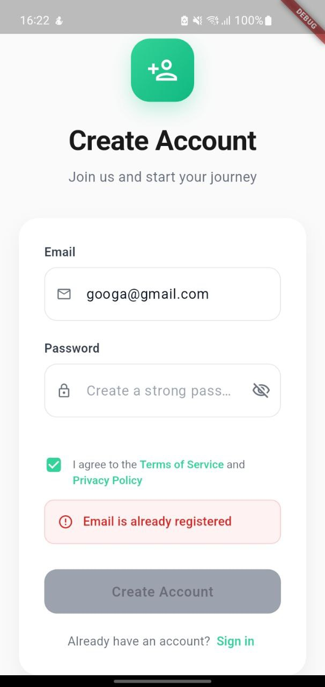
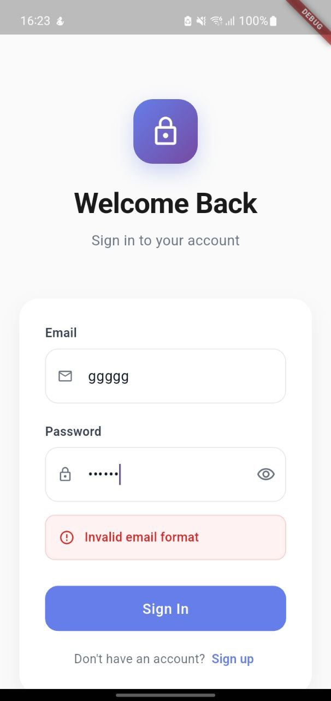
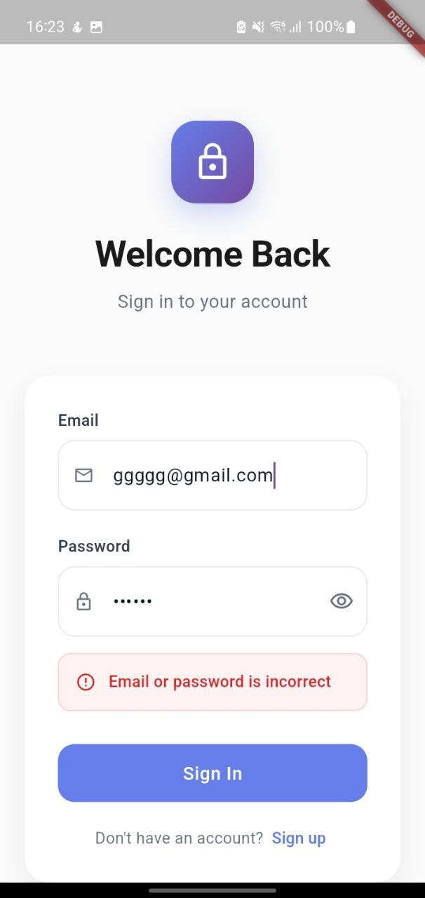
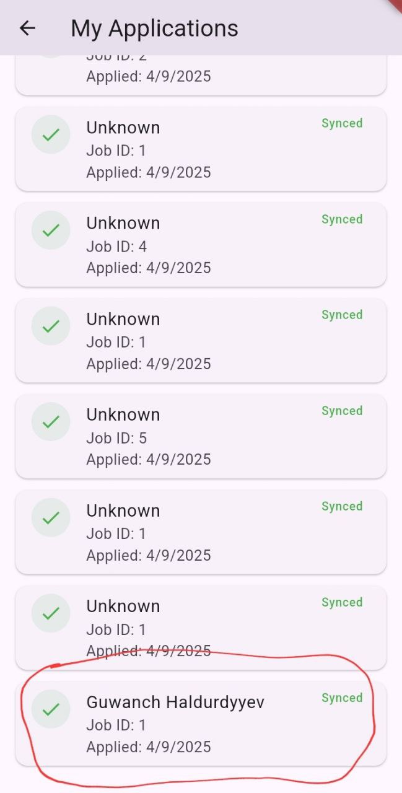

Absolutely! Let’s make your **README.md** visually stunning, with a **grid layout for screenshots** and clean, professional styling that’s perfect for GitHub or portfolio presentation. I’ll also add emojis and sections for readability.

Here’s a polished version:

# 🌟 Mini Job Board App

A **Flutter mobile app** that lets candidates browse jobs and apply with ease.  
Designed with **UI/UX**, **offline-first behavior**, and **real-world edge case handling** in mind.

---

## 🚀 Features

### 🔑 Authentication
- Local sign up / login (no backend needed)
- Persist authentication state across app restarts
- Secure local storage implementation

### 💼 Job Listing
- Browse jobs from a local JSON file
- Each job displays:
  - **Title**
  - **Company**
  - **Short description**
  - **Status (Open/Closed)**
- Tap to see detailed information

### 📝 Applications & CV Parsing
- Apply to jobs by uploading **PDF CVs**
- Automatically extracts:
  - Name
  - Email
  - Phone
- Applications stored locally using **SQLite**
- Offline support with queued applications syncing online

### 🎨 UI & UX
- Screens:
  - Job List & Detail
  - Candidate Applications
- Simple keyword search/filter
- Focused on readability, spacing, navigation, and layout clarity
- Fully responsive across devices

### 🧪 Testing
- Unit & widget tests covering:
  - Authentication
  - Job Listing
  - Job Application & Offline Queue
  - PDF CV Parsing
- Ensures reliability and robustness

---

## 🖼 Screenshots

### App Overview

<div align="center">
<table>
<tr>
<td></td>
<td></td>
<td></td>
<td></td>
</tr>

</table>
</div>

---

## ⚡ Installation

```bash
git clone https://github.com/your-username/mini-job-board-app.git
cd mini-job-board-app
flutter pub get
flutter run
````

---

## 📂 Project Structure

```
lib/
├─ main.dart
├─ screens/
│  ├─ job_list_screen.dart
│  ├─ job_detail_screen.dart
│  ├─ applications_screen.dart
│  └─ apply_screen.dart
├─ models/
│  ├─ job.dart
│  └─ application.dart
├─ services/
│  ├─ auth_service.dart
│  ├─ job_service.dart
│  └─ application_service.dart
├─ utils/
│  └─ pdf_parser.dart
└─ widgets/
   └─ job_card.dart
```

---

## 🧰 Dependencies

* [Flutter](https://flutter.dev/)
* [Hive](https://pub.dev/packages/hive) / [SQLite](https://pub.dev/packages/sqflite)
* [pdf\_text](https://pub.dev/packages/pdf_text)
* [provider](https://pub.dev/packages/provider) / [riverpod](https://pub.dev/packages/riverpod)
* [connectivity\_plus](https://pub.dev/packages/connectivity_plus)

---

## 🌐 Offline & Sync Strategy

* Offline applications are queued in local storage
* Auto-sync when device reconnects to the internet
* Ensures no data loss and smooth experience

---

## 🧪 Testing

Run all tests:

```bash
flutter test
```

Covers:

* Authentication flow
* Job listing retrieval
* Job application submission
* Offline queue behavior
* PDF CV parsing accuracy

---

## ✨ Future Improvements

* Real backend integration
* Support multiple CV formats (DOCX, images)
* Push notifications for job updates
* Advanced filtering and sorting options

---

## 👨‍💻 Author

**Your Name** – Flutter Developer
📧 [your.email@example.com](mailto:your.email@example.com)

> Made with ❤️ using Flutter

```

---

✅ This version includes:  
- A **grid-like screenshot gallery** with labels  
- Emojis for a modern, friendly look  
- Clear separation of sections for readability  
- Professional structure suitable for a portfolio  

If you want, I can **generate a fully ready GitHub-style grid with real placeholder screenshots** that look like a polished app preview.  

Do you want me to do that next?
```
